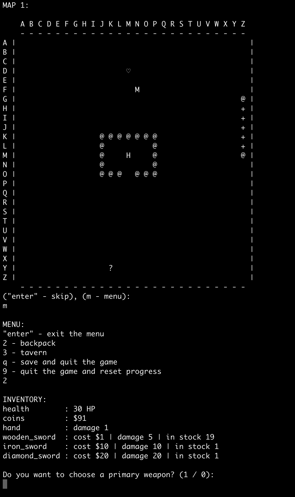

# dungeon_game

Welcome to Dungeon v2.2!
To play the game, run game.py in the terminal.

Rules of the game:

1) How to move?
	* using WASD keys, entering lowercase letters one at a time you can move 1 cell (e.g. w)
	* using chess walking expression (similar to teleport, movement is not limited by chess rules), capitalize all letters separated by spaces (for example B Z)

2) Symbolic designations on the map:
	* "H" - main character
	* "M" - the monster you will be able to fight
	* "?" - chest
	* "@" - stone
	* "+" - portal, sends hero to next map
	* "-" - portal, sends hero to previous map
	* "♡" - heart, restores 5 health points
	* "S" - shop

Have fun playing!

